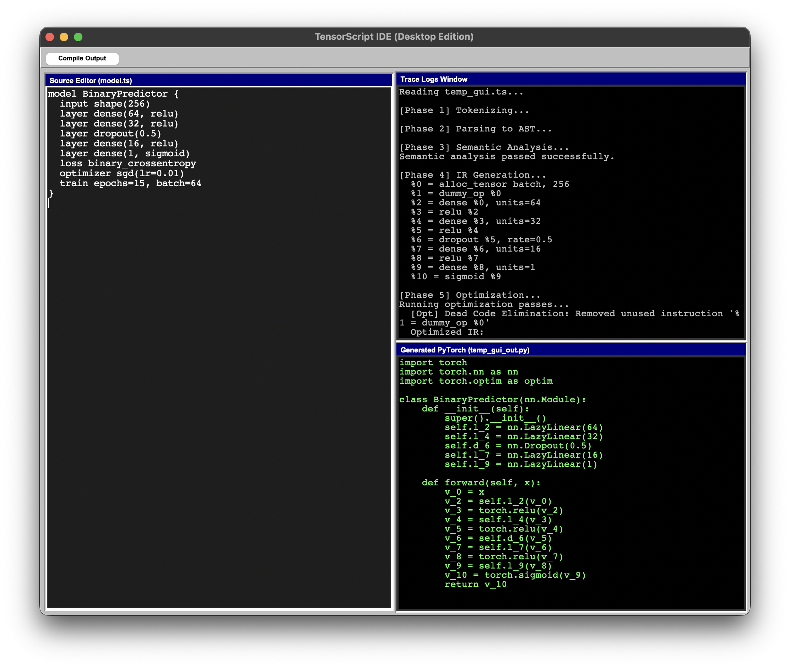
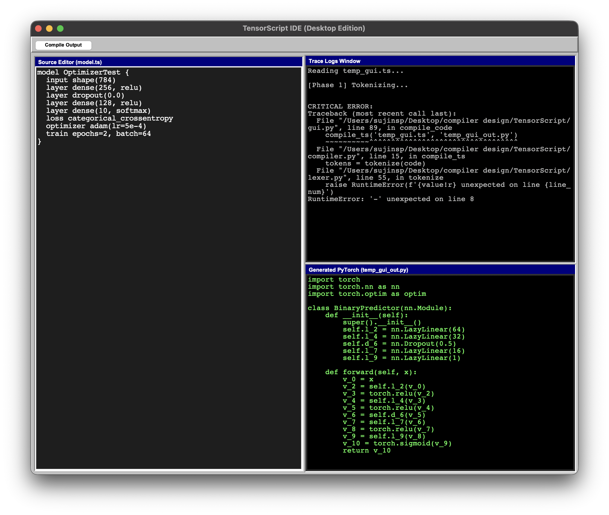

<div align="center">
  <h1>TensorScript Compiler</h1>
  <p>
    
    
    
  </p>
  <p><i>A bespoke Domain-Specific Language (DSL) designed for constructing deep learning neural networks.</i></p>
</div>

TensorScript is a bespoke Domain-Specific Language (DSL) specifically designed for constructing and training deep learning neural networks elegantly. This repository features a fully operational **7-Phase Custom Python Compiler** that translates TensorScript `.ts` code into fully actionable PyTorch training scripts seamlessly.

In addition to the raw compiler, this project features a built-in Desktop App Interface mimicking Native 90's OS graphical design, letting you edit code and review Intermediate Representation (IR) logs directly on your local system without any web dependencies. 

## 📸 Application Gallery

Here is a look at the TensorScript Desktop IDE in action:

<div align="center">
  
  
</div>

<br>

### Native Desktop App Styling Overview
- **Retro Terminal Output Design**: The generated PyTorch IDE panels intentionally use stark `#000000` Black backgrounds matched vividly with Hacker-Green (`#55ff55`) monospaced typographies for a distinct retro-computational aesthetic. This design optimizes contrast against standard built-in MacOS dark-mode text overriding.
- **Robust Multi-Panel Windowing Constraints**: Pure `tkinter` mathematical `Grid.place` layout parameters ensure perfect OS compatibility natively, protecting against Mac Tkinter collapsing-rendering bugs seamlessly!

---

## 🏗 Compiler Architecture (The 7 Phases)

The compilation pipeline operates entirely independently without large code-parsing engines (like ANTLR) and is structured sequentially across 7 core environments:

1. **Phase 1 (Lexer / Tokenizer - `lexer.py`)**: Converts raw `.ts` text into a rigorously checked token stream using handcrafted regex models recognizing keywords (like `model`, `dense`, `dropout`).
2. **Phase 2 (Parser & AST - `parser.py` / `ast_nodes.py`)**: Utilizes a classic recursive descent parser mapping the token streams into a custom Abstract Syntax Tree.
3. **Phase 3 (Semantic Analyzer - `semantic.py`)**: Verifies semantic layout constraints conceptually. Ensuring `loss categorical_crossentropy` accurately pairs structurally with `softmax` activation blocks natively.
4. **Phase 4 (Intermediate Representation - `ir.py`)**: Lowers the AST nodes into a robust 3-Address Code structural map tracing variables predictably (`%0 = alloc_tensor`, `%1 = dense %0`).
5. **Phase 5 (Optimizer - `optimizer.py`)**: Employs two major compiler passes before executing code logic:
    - **Dead Code Elimination (DCE)**: Identifies and wipes unused computational nodes organically.
    - **Constant Folding**: Cancels non-functional mathematics (e.g. `dropout(0.0)`) instantly.
6. **Phase 6 (Code Generation - `codegen.py`)**: A functional emitter mapping the finalized IR variables cleanly into structured equivalent Native PyTorch objects.
7. **Phase 7 (Link & Execution - `compiler.py` / `run.sh`)**: The orchestrator pipeline binding inputs to executions!

---

## 🛠 Step-by-Step Instructions

This compiler maps directly onto standard OS environments.

### 1. Project Prerequisites
You must have Python 3.9+ actively installed and access to pip dependency controls to fetch PyTorch functionally.

Open your local terminal and navigate to the project directory:
```bash
cd "/Users/sujinsp/Desktop/compiler design/TensorScript"
```

### 2. Installing Environment Dependencies
The only true dependency required to actually simulate and train the Models is PyTorch securely. To ensure environments run correctly, pull dependencies from standard repositories via `pip`:
```bash
python3 -m pip install -r requirements.txt
```

### 3. Running the Native Desktop App (Recommended)
You can visually boot up the Graphic IDE to edit TensorScript and hit "Compile" visually!
```bash
python3 gui.py
```
> *Note: By clicking 'Compile Output' in the Graphical User Interface, you will see Trace Logs and Outputs automatically populate within the Tabs in real time!*

### 4. Running the Compiler Manually from Terminal
If you prefer running operations completely headless, you can feed TensorScript code (`example.ts`) directly into the script. The compiler binds traces securely and will output a secondary Python file:
```bash
python3 compiler.py example.ts generated_model.py
``` 

### 5. Executing training logic directly
After compiling an external python file (either via `gui.py` or manually through the `compiler.py`), you can test the neural network immediately against dynamically loaded data iterators seamlessly by running the generated artifact directly on your local system:
```bash
python3 generated_model.py
``` 
*(If running correctly you should observe iterative `Epoch` data logging with active Loss variables structurally!)* 

---

## 📝 TensorScript Language Example
To get a feel for the design aesthetics TensorScript offers natively, look over this core structural implementation file:

```typescript
model Classifier {
  input shape(784)
  layer dense(128, relu)
  layer dropout(0.3)
  layer dense(10, softmax)
  loss categorical_crossentropy
  optimizer adam(lr=0.001)
  train epochs=5, batch=32
}
```
